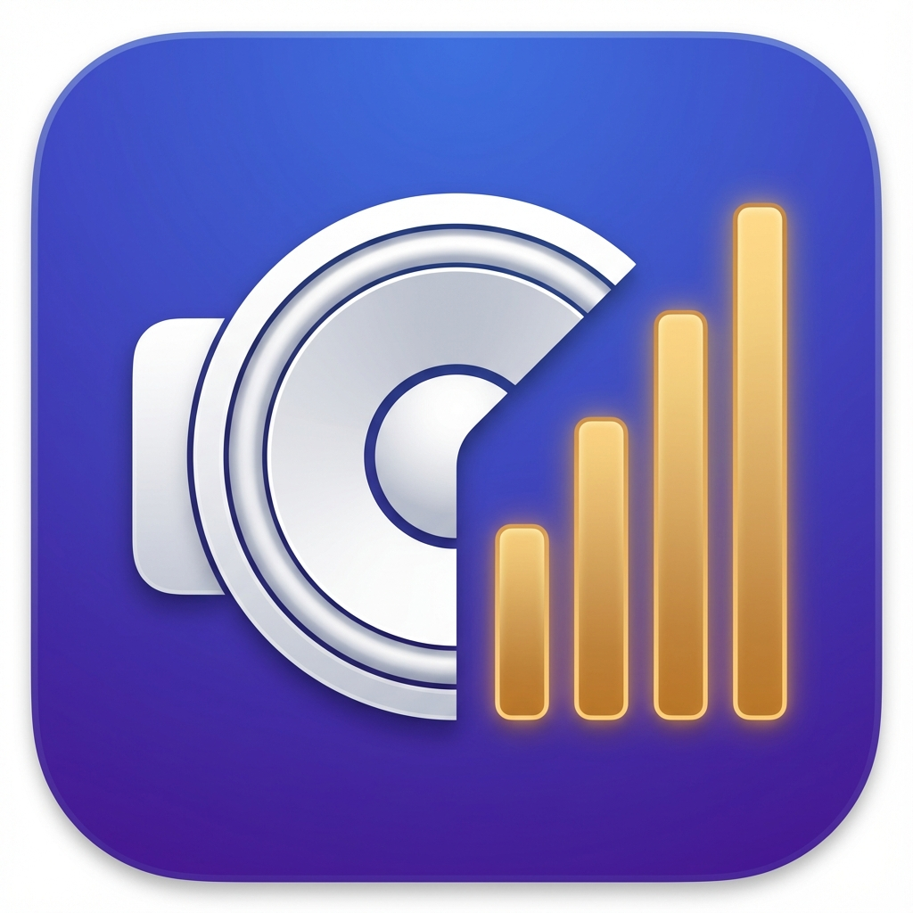

<p align="center">
  
</p>

<h1 align="center">AV Priority Bar</h1>

<p align="center">
  Rank your speakers, headphones, microphones and cameras once.<br>
  Your Mac then picks the best one that's plugged in, every time, on its own.
</p>

<p align="center">
  <b><a href="https://paul10142.github.io/av-priority-bar/">av priority bar website</a></b>
  &nbsp;·&nbsp;
  <b><a href="https://github.com/tobi/AudioPriorityBar">the original by tobi</a></b>
</p>

---

## Why this exists

[Audio Priority Bar](https://github.com/tobi/AudioPriorityBar) by
[tobi](https://github.com/tobi) solves a real annoyance: macOS switches your
sound to whatever was plugged in last, not to whatever you actually prefer. Rank
your devices and it follows your ranking instead.

Cameras have the same problem and no equivalent fix. This is a fork that adds
them, alongside a floating camera window so a mirror check doesn't need a second
app.

## What it does

**Audio priority.** Speakers, headphones and microphones each get a list. Drag
them into the order you want. When something connects or disconnects, the
highest-ranked device that's actually available becomes the system default.
Clicking a device switches to it now without changing its rank — only dragging
changes the order.

**Camera priority.** The same idea for cameras, using the system-wide preferred
camera macOS has exposed since Sonoma. Apps that ask macOS for the default
camera follow it: FaceTime, Photo Booth, and most apps without their own camera
picker. Apps that remember their own choice — Zoom, Teams, OBS, Meet in a
browser — ignore it, and no app can make them do otherwise.

**A floating camera window.** Resizable, movable, mirrored, always-on-top if you
want it, and it remembers where you left it. Open it with a keyboard shortcut
from anywhere, from the menu, or by clicking the notch. Close it by clicking
away, after a delay, or only when you say so.

**Volume and mute in one place.** A slider and a mute button for the active
speaker, headphone and microphone, each driving that specific device. Devices
with no volume control say so rather than showing a slider that does nothing.

**Mic check.** A live level meter at the bottom of the audio tab, so "can you
hear me?" has an answer before the call starts.

**Ignore what you don't use.** Virtual cameras, aggregate devices and anything
else you never want chosen. Ignores are remembered by name as well as by device
ID, because macOS gives some devices a new ID every time they appear.

## Install

You build it yourself — there is no signed release.

```bash
git clone https://github.com/Paul10142/av-priority-bar.git
cd av-priority-bar
./install.sh
```

That compiles the app, puts it in `/Applications`, and launches it. A speaker
icon appears in your menu bar; there is no dock icon and no window.

`./build.sh` alone builds to `dist/AVPriorityBar.app` without installing.

You need the Xcode Command Line Tools (`xcode-select --install`). Full Xcode is
not required — the build compiles the Swift sources with `swiftc`, generates the
icon with `sips` and `iconutil`, assembles the bundle and signs it ad-hoc. It
also works around a Command Line Tools bug that declares `SwiftBridging` in two
module maps and otherwise fails every compile.

Requires macOS 14 or later, Apple Silicon.

## Permissions

**Camera access is required for camera switching to work at all.** macOS ignores
a camera preference written by an app it hasn't granted camera access. The app
opens a video stream in exactly one place — the live preview — and the green
camera light tracks that window honestly.

**Microphone access** is only for the mic check meter. Nothing is recorded.

## Menu bar managers (Ice, Bartender)

New icons are usually dropped into a manager's hidden section, where you'll
never find them. This app claims a visible position on first launch to avoid
that. If it still hides, drag it into the visible section in your manager's
settings, or ⌘-drag it along the menu bar.

If the icon is missing entirely and the app is running, macOS's menu bar
services are wedged — it happens, and it takes every menu bar app with it.
Log out and back in.

## Credits

- [Audio Priority Bar](https://github.com/tobi/AudioPriorityBar) by
  [tobi](https://github.com/tobi) — all of the audio side, and the idea.
- [Cadence](https://github.com/Paul10142/cadence) — the Xcode-free build and the
  menu bar positioning fix.

MIT licensed. See [LICENSE](LICENSE).

---

<p align="center">
  <a href="https://paul10142.github.io/av-priority-bar/">paul10142.github.io/av-priority-bar</a>
</p>
